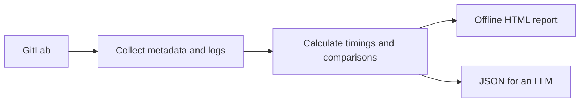

[English](README.md) | [Русский](README.ru.md)

# GitLab CI Performance Analyzer

Find where GitLab CI jobs spend time. This agent skill compares runs, separates
runner waiting time from execution, and helps you inspect slow build steps.
It reads GitLab data without changing CI configuration or runners.

Get an offline HTML report or JSON for an LLM. The interface supports English,
Russian, light and dark themes, and keyboard navigation. Download the HTML and
open it locally; no server or other files are needed.



Try the synthetic [canonical report](examples/v2/report.html), or the reviewed
report in [English](examples/reviewed/report.html) or
[Russian](examples/reviewed/report-ru.html). Download the HTML file to view it.
These examples contain no real project data.


## Terms used in the report

- **Job:** a CI task, such as building an image or running tests.
- **Pipeline:** a set of CI jobs started together.
- **Attempt:** one job run. A retry has its own job ID.
- **Ref:** the Git branch or tag associated with a run.
- **Baseline:** earlier comparable successful runs used for comparison.
- **Provenance:** the source of a value, such as a job ID, log line or file hash.

## Choose a report route

| What you need | CLI | History shown | Log content in the report |
| --- | --- | --- | --- |
| Job timings with original BuildKit steps and logs | `report_cli.py` (canonical) | 16 or 32 attempts per page; default 16; retains up to 64 per job type | Original text and received bytes, with copy and download controls |
| Job timings with extracted evidence | `ci_report.py` (reviewed) | 32 or 64 attempts per page; default 32; retains up to 64 per job type | Extracted timings and source line references; no raw logs |
| A verified release or test workflow across jobs | `ci_report.py` with `--workflow-window` | 32 or 64 pipeline runs; default 32 | Job metadata; this mode does not request logs |

A job type is a `(stage, name)` pair. Job reports select the baseline independently
of the display page. Canonical comparisons use up to 10 earlier eligible successes.
Workflow baselines stay within the selected pipeline window. Each route has its
own file format; keep their files separate.

## Install or update

You need Python 3.10+, `glab` authenticated for your GitLab host, and the Python
dependencies in [requirements.txt](skills/gitlab-ci-performance/requirements.txt).

1. From your target project directory, copy the skill and create the agent links:

   ```sh
   git clone --depth 1 \
     https://github.com/mesilov/gitlab-ci-performance-skill.git /tmp/ci-skill
   mkdir -p .agents/skills .codex/skills .claude/skills
   cp -R /tmp/ci-skill/skills/gitlab-ci-performance .agents/skills/
   ln -s ../../.agents/skills/gitlab-ci-performance .codex/skills/gitlab-ci-performance
   ln -s ../../.agents/skills/gitlab-ci-performance .claude/skills/gitlab-ci-performance
   ```

2. Prepare a Python environment. The CLI examples below run from this clone:

   ```sh
   cd /tmp/ci-skill
   python3 -m venv .venv
   .venv/bin/python -m pip install --only-binary=:all: -r skills/gitlab-ci-performance/requirements.txt
   ```

3. In your target project, invoke `$gitlab-ci-performance` in Codex or
   `/gitlab-ci-performance` in Claude Code. Follow the project's instructions.
   Give the agent the Python interpreter path if it cannot find the dependencies.

To update, move the old `.agents/skills/gitlab-ci-performance` directory to an
unused backup location. Keep reports, private caches and customizations there.
Copy the new skill into its place; existing links still work. Do not overlay old
modules. The installed skill needs no repository tests or examples.

## Create your first job report

Use the canonical route for original build steps and log inspection. From
`/tmp/ci-skill`, run the commands below. Replace the host, project and
`build/image_build` with your GitLab host, project path and `stage/name`.
Repeat `--job` to select more job types. For names containing `/`, use
[`--job-config`](skills/gitlab-ci-performance/references/contract-v2.md#collection-coverage-and-budgets).

```sh
.venv/bin/python skills/gitlab-ci-performance/scripts/report_cli.py collect \
  --host gitlab.example.com --project group/service --job build/image_build \
  --timezone UTC --output reports/run-001/jobs.json
.venv/bin/python skills/gitlab-ci-performance/scripts/report_cli.py report \
  --snapshot reports/run-001/jobs.json --output reports/run-001/report.json
.venv/bin/python skills/gitlab-ci-performance/scripts/report_cli.py render \
  --report reports/run-001/report.json --language en --output reports/run-001/report.html
.venv/bin/python skills/gitlab-ci-performance/scripts/report_cli.py export \
  --report reports/run-001/report.json --scope overview --output reports/run-001/overview.json
```

Open `reports/run-001/report.html`. Use `--language ru` for Russian.
Defaults: UTC time zone and English saved report language.

Only `collect` contacts GitLab. Calculation, export and rendering use saved data
and work offline. Each command creates new output files; choose a new directory
for another run. The commands validate their inputs and outputs. Use
`report_cli.py validate artifact.json` when checking a separately obtained artifact.

**Sharing:** canonical JSON and HTML contain original logs, which can include
sensitive values. Review them before sharing. The overview export omits logs,
but still includes project and job information. See the
[log and format contract](skills/gitlab-ci-performance/references/contract-v2.md).

## Create a reviewed job report

Use this route when you need extracted timings rather than raw logs. From the
same clone and Python environment:

```sh
.venv/bin/python skills/gitlab-ci-performance/scripts/ci_report.py collect \
  --host gitlab.example.com --project group/service --timezone UTC \
  --output reports/reviewed-run/jobs.json
.venv/bin/python skills/gitlab-ci-performance/scripts/ci_report.py collect-details \
  --snapshot reports/reviewed-run/jobs.json --output-dir reports/reviewed-run/details --workers 4
.venv/bin/python skills/gitlab-ci-performance/scripts/ci_report.py report \
  --snapshot reports/reviewed-run/jobs.json --details reports/reviewed-run/details \
  --output reports/reviewed-run/report.json
.venv/bin/python skills/gitlab-ci-performance/scripts/ci_report.py render \
  --report reports/reviewed-run/report.json --language en --output reports/reviewed-run/report.html
```

`collect` reads job metadata. `collect-details` refreshes the latest 64 attempts
per job type and analyzes their logs. Repeated `--job NAME` and `--stage STAGE`
options restrict detail collection; `--no-traces` disables log analysis.
Reports still contain project and job names and URLs. An optional raw-log cache
is private and must not be published. See [trace and cache rules](skills/gitlab-ci-performance/references/trace-analysis.md).

## Analyze a workflow across jobs


Analyze a release chain, test flow or independent operation. Verify the resolved
CI configuration, then define jobs and dependencies with `define-workflows`.
Use the [workflow model](skills/gitlab-ci-performance/assets/workflow-model.json)
and [workflow guide](skills/gitlab-ci-performance/references/workflows.md).

Collect with `--workflow-window` for 32 pipeline runs or `--workflow-window 64`
for 64. Every retained job attempt in those pipelines remains available.
Calculate with `report --workflows workflows.json`, then use `render` and,
if needed, `export-llm`. These are pipeline windows, not job-attempt page sizes.
Missing historical configuration is reported explicitly. Chains across separate
pipelines are unsupported.

## Read the results

Select a job to see history, comparisons and timing evidence. Waiting and execution
are separate; failed, canceled and retried jobs stay visible. Inspect runner phases,
BuildKit builds, operations and source lines when available. Missing or partial
logs are marked explicitly.

A comparison needs enough comparable successful runs. Read the sample count and
coverage before drawing conclusions. Unknown time is not zero. Parallel steps and
nested operations overlap; their durations are not added as promised savings.
A long duration alone does not identify its cause. Comparisons across refs are
exploratory and do not prove a regression.

Canonical collection limits each log to 4 MiB or 50,000 lines and marks incomplete
data. Serialized canonical JSON can be up to 64 MiB; this is not an HTML or process
memory limit. Older masked canonical files are rejected. Collect fresh data or
reprocess saved original logs. See [the contract](skills/gitlab-ci-performance/references/contract-v2.md)
for versions, limits and compatibility.

## Further reading

- [Job comparison rules and calculations](skills/gitlab-ci-performance/references/methodology.md).
- [Reviewed trace precision, limits and caches](skills/gitlab-ci-performance/references/trace-analysis.md).
- [Canonical formats, logs, exports and compatibility](skills/gitlab-ci-performance/references/contract-v2.md).
- [Workflow definitions and pipeline comparisons](skills/gitlab-ci-performance/references/workflows.md).
- [Job catalog example](examples/reviewed/catalog.json): pass `report --catalog catalog.json` to add verified job purposes. Current configuration evidence does not describe every historical run.
- [Reviewed release comparisons](skills/gitlab-ci-performance/references/release-history.md) with `--release-refs` and `--baseline`.
- [Changelog](CHANGELOG.md).

## Development

For changes to the skill, run the relevant checks. The full Python suite is:

```sh
.venv/bin/python -m unittest discover -s tests -v
```

Synthetic generators and browser checks are documented in the
[CI workflow](.github/workflows/check.yml). Browser checks use Playwright and cover
both languages, mobile layouts, themes, keyboard access and offline use.
Building another report with the published skill does not require the full local
test or browser suite.

MIT — [license](LICENSE).
