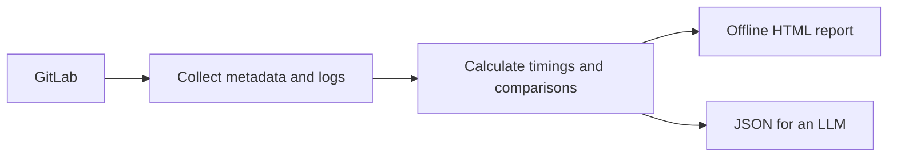

[English](README.md) | [Русский](README.ru.md)

# GitLab CI Performance Analyzer

Find slow jobs in GitLab CI. This agent skill compares runs and shows where each
job spends time. It separates runner waiting time from execution time.
It reads GitLab data without changes to CI configuration or runners.

The skill creates an HTML report for offline use and exports JSON for an LLM.
The report supports English, Russian, light and dark themes, and keyboard
navigation.

Download the HTML file. Open it locally. The report needs no server or other files.



Try the [canonical report](examples/v2/report.html), or the reviewed report in
[English](examples/reviewed/report.html) or
[Russian](examples/reviewed/report-ru.html). Download the HTML file to view it.

All examples use synthetic data. They contain no real project data.


## Terms used in the report

- **Job:** a CI task, such as an image build or a test run.
- **Pipeline:** a set of CI jobs started together.
- **Attempt:** one job run. A retry has its own job ID.
- **Ref:** the Git branch or tag associated with a run.
- **Baseline:** earlier comparable successful runs used for comparison.
- **Provenance:** the source of a value, such as a job ID, log line or file hash.

## Choose a report

| What you need | CLI | History shown | Log content in the report |
| --- | --- | --- | --- |
| Job timings with original BuildKit steps and logs | `report_cli.py` (canonical) | 16 or 32 attempts per page. Default: 16. Retains up to 64 per job type. | Original text and received bytes. Copy and download controls. |
| Job timings with extracted evidence | `ci_report.py` (reviewed) | 32 or 64 attempts per page. Default: 32. Retains up to 64 per job type. | Extracted timings and source line references. No raw logs. |
| A checked release or test workflow across jobs | `ci_report.py` with `--workflow-window` | 32 or 64 pipeline runs. Default: 32. | Job metadata. This mode does not request logs. |

A job type is a `(stage, name)` pair. Job reports select the baseline separately
from the page of history. Canonical comparisons use up to 10 earlier successful
runs that meet the comparison rules. Workflow baselines use only runs in the
selected pipeline window.

Each report route uses its own file format.

Keep files from different routes separate.

## Install the skill

You need Python 3.10+ and the Python dependencies in
[requirements.txt](skills/gitlab-ci-performance/requirements.txt). GitLab collection
also requires `glab` authentication for your GitLab host. Local `--help` and offline
commands need no GitLab authentication.

1. Use the official upstream repository in the clone command.
   The clone selects the current default branch.

   For a pinned version, select the required tag or commit before you copy the skill.
   Make sure that the clone origin matches the repository URL.
   Record the commit that `rev-parse` prints.
   From your target project directory, run these commands:

   ```sh
   git clone --depth 1 \
     https://github.com/mesilov/gitlab-ci-performance-skill.git /tmp/ci-skill
   git -C /tmp/ci-skill rev-parse HEAD
   mkdir -p .agents/skills .codex/skills .claude/skills
   cp -R /tmp/ci-skill/skills/gitlab-ci-performance .agents/skills/
   ln -s ../../.agents/skills/gitlab-ci-performance .codex/skills/gitlab-ci-performance
   ln -s ../../.agents/skills/gitlab-ci-performance .claude/skills/gitlab-ci-performance
   ```

2. Create a Python environment in the clone:

   ```sh
   cd /tmp/ci-skill
   python3 -m venv .venv
   .venv/bin/python -m pip install --only-binary=:all: -r skills/gitlab-ci-performance/requirements.txt
   ```

   The CLI examples use this clone and Python environment.

3. In your target project, run `$gitlab-ci-performance` in Codex or
   `/gitlab-ci-performance` in Claude Code.
   Obey the project instructions.
   If the agent cannot find the dependencies, give it the Python interpreter path.

## Update the skill

1. Move the old `.agents/skills/gitlab-ci-performance` directory to an unused backup location.
2. Keep reports, private caches and customizations in that backup.
3. Copy the new skill into the original location.
4. Do not copy new modules over old modules.
5. Make sure that the installed files match the selected upstream commit.
6. Make sure that the Python environment contains the dependencies.

The existing agent links still work after the update.

### Check an installation or update

If the task is only an installation or update, run the installed helper with `--help`.
For example, run `python <skill-dir>/scripts/report_cli.py --help`.
Then report the installed directory and resolved commit.

This local check shows that the CLI starts. It needs no GitLab project, saved
report inputs or GitLab connection. The `--help` command does not check a complete
report run.

Do not request report inputs for an installation check.
Do not collect GitLab data only to check an installation.
If the task also requests a report, create that report through the installed copy.
Do not obtain the whole repository only to repeat tests for a ready version.

An installation or update of a ready version is separate from skill development
and release checks.

## Report use and checks

For a requested report, run the documented commands with compatible inputs.
Keep the built-in checks enabled.
For an offline report, reuse saved data.
Finish with a report link.
Do not repeat a successful built-in check with a separate check command.

Routine reports and ready updates do not require the full unit/CLI suite, browser
QA or install/update regression tests. Do not add scripts that recheck numbers,
headings or every detail view. New logs, regenerated files, a schema change or a
large report alone do not require a full test run.

Additional checks during use require one of these reasons:

- The user requests tests.
- A command fails.
- The data contains a concrete contradiction.
- A new edge case lacks support.

Start with the smallest reproduction.
Add new edge cases to the repository regression tests.
Run the affected workflow to check the fix.
See [execution rules](skills/gitlab-ci-performance/SKILL.md#execution-modes-and-check-scope).

## Create your first job report

Use the canonical route for original build steps and logs.
From `/tmp/ci-skill`, run the commands in this section.
Replace the host, project and `build/image_build` with your GitLab host, project
path and `stage/name`.
Repeat `--job` to select more job types. For names that contain `/`, use
[`--job-config`](skills/gitlab-ci-performance/references/contract-v2.md#collection-coverage-and-budgets).

```sh
.venv/bin/python skills/gitlab-ci-performance/scripts/report_cli.py collect \
  --host gitlab.example.com --project group/service --job build/image_build \
  --timezone UTC --output reports/run-001/jobs.json
.venv/bin/python skills/gitlab-ci-performance/scripts/report_cli.py report \
  --snapshot reports/run-001/jobs.json --output reports/run-001/report.json
.venv/bin/python skills/gitlab-ci-performance/scripts/report_cli.py render \
  --report reports/run-001/report.json --language en --output reports/run-001/report.html
.venv/bin/python skills/gitlab-ci-performance/scripts/report_cli.py export \
  --report reports/run-001/report.json --scope overview --output reports/run-001/overview.json
```

Open `reports/run-001/report.html`.
For Russian, use `--language ru`.

The default time zone is UTC. The default language for a saved report is English.

Only `collect` contacts GitLab. Calculation, export and rendering use saved data
and work offline. Each command creates new output files. The commands check
their inputs and outputs.

For another run, choose a new output directory.
For an artifact from another source, run `report_cli.py validate artifact.json`.

**Before you share a report, inspect its contents.** Canonical JSON and HTML
contain original logs. Those logs can contain sensitive values. The overview
export omits logs, but still includes project and job information. See the
[log and format contract](skills/gitlab-ci-performance/references/contract-v2.md).

## Create a reviewed job report

If you need extracted timings without raw logs, use the reviewed route.
From the same clone and Python environment, run these commands:

```sh
.venv/bin/python skills/gitlab-ci-performance/scripts/ci_report.py collect \
  --host gitlab.example.com --project group/service --timezone UTC \
  --output reports/reviewed-run/jobs.json
.venv/bin/python skills/gitlab-ci-performance/scripts/ci_report.py collect-details \
  --snapshot reports/reviewed-run/jobs.json --output-dir reports/reviewed-run/details --workers 4
.venv/bin/python skills/gitlab-ci-performance/scripts/ci_report.py report \
  --snapshot reports/reviewed-run/jobs.json --details reports/reviewed-run/details \
  --output reports/reviewed-run/report.json
.venv/bin/python skills/gitlab-ci-performance/scripts/ci_report.py render \
  --report reports/reviewed-run/report.json --language en --output reports/reviewed-run/report.html
```

`collect` reads job metadata. `collect-details` refreshes the latest 64 attempts
per job type and analyzes their logs. The `--no-traces` flag disables log analysis.
Reports still contain project and job names and URLs.

Repeat `--job NAME` and `--stage STAGE` to restrict detail collection.
Do not publish the optional raw-log cache.
See [trace and cache rules](skills/gitlab-ci-performance/references/trace-analysis.md).

## Analyze a workflow across jobs


Analyze a release chain, test flow or independent operation.
Make sure that the resolved CI configuration matches the workflow.
Then define jobs and dependencies with `define-workflows`.
Use the [workflow model](skills/gitlab-ci-performance/assets/workflow-model.json)
and [workflow guide](skills/gitlab-ci-performance/references/workflows.md).

For 32 pipeline runs, collect with `--workflow-window`.
For 64 pipeline runs, collect with `--workflow-window 64`.
Calculate the report with `report --workflows workflows.json`.
Then use `render` to create the HTML report.
For JSON output for an LLM, use `export-llm`.

These limits select pipeline windows. They do not select page sizes for job
attempts. Every retained job attempt in those pipelines remains available.
The report marks missing historical configuration. Chains across separate
pipelines lack support.

## Read the results

Select a job to see its history, comparisons and timing evidence.
If the report contains timing evidence, inspect the runner phases, BuildKit builds,
operations and source lines.

The report separates waiting time from execution time. It keeps failed, canceled
and retried jobs visible. It marks missing or partial logs.

A comparison needs enough comparable successful runs.

Read the sample count and coverage before you draw conclusions.

Unknown time is not zero. Parallel steps and nested operations overlap.
Their combined durations do not represent promised savings.
A long duration alone does not identify its cause. Comparisons across refs help
explore differences, but do not prove a regression.

Canonical collection limits each log to 4 MiB or 50,000 lines. It marks incomplete
data. Serialized canonical JSON can be up to 64 MiB. This limit does not apply
to HTML size or process memory. The canonical route rejects older masked files.

For older masked files, collect fresh data or reprocess saved original logs.
See [the contract](skills/gitlab-ci-performance/references/contract-v2.md) for
versions, limits and compatibility.

## Further reading

- [Job comparison rules and calculations](skills/gitlab-ci-performance/references/methodology.md).
- [Reviewed trace precision, limits and caches](skills/gitlab-ci-performance/references/trace-analysis.md).
- [Canonical formats, logs, exports and compatibility](skills/gitlab-ci-performance/references/contract-v2.md).
- [Workflow definitions and pipeline comparisons](skills/gitlab-ci-performance/references/workflows.md).
- [Job catalog example](examples/reviewed/catalog.json): pass `report --catalog catalog.json` to add checked job purposes. Current configuration evidence does not describe every historical run.
- [Reviewed release comparisons](skills/gitlab-ci-performance/references/release-history.md) with `--release-refs` and `--baseline`.
- [Changelog](CHANGELOG.md).

## Development

For changes to the skill, run the relevant checks.
For the full Python suite, run:

```sh
.venv/bin/python -m unittest discover -s tests -v
```

The [CI workflow](.github/workflows/check.yml) documents synthetic generators and
browser checks. Browser checks use Playwright and cover
both languages, mobile layouts, themes, keyboard access and offline use.
Another report from the published skill does not require the full local test
or browser suite.

MIT — [license](LICENSE).
