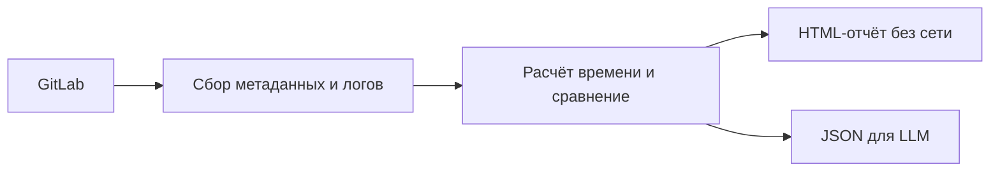
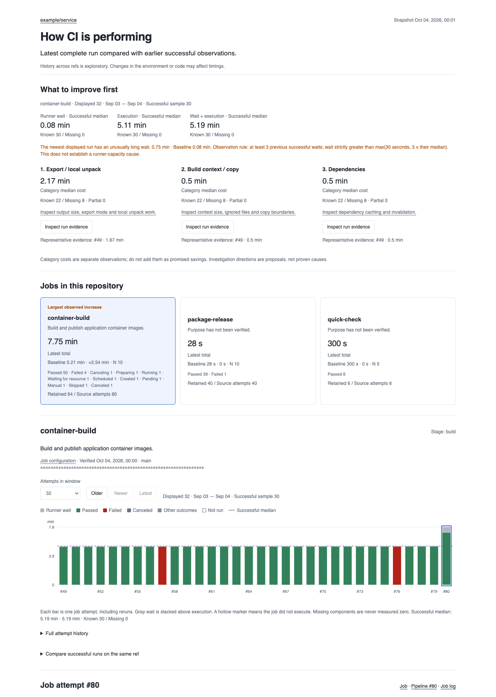
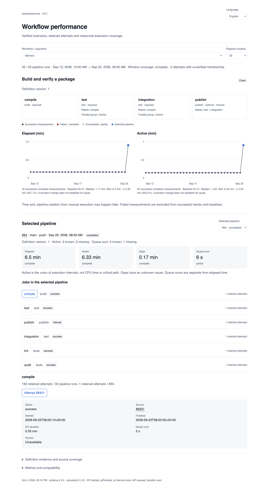

[English](README.md) | [Русский](README.ru.md)

# GitLab CI Performance Analyzer

Узнайте, на что уходит время в GitLab CI. Этот скилл для агента сравнивает запуски,
отделяет ожидание runner от выполнения и помогает изучить медленные шаги сборки.
Он читает данные GitLab, не меняя настройки CI или runner.

Результат — HTML-отчёт, который работает без сети. Можно также выгрузить JSON для
LLM. В интерфейсе есть русский и английский языки, светлая и тёмная темы,
управление с клавиатуры. Скачайте HTML и откройте локально: сервер и другие файлы
не нужны.



Посмотрите синтетический [канонический отчёт](examples/v2/report.html) или
reviewed-отчёт [на английском](examples/reviewed/report.html) и
[на русском](examples/reviewed/report-ru.html). Скачайте HTML для просмотра.
Эти примеры не содержат данных реальных проектов.



## Термины в отчёте

- **Job:** задача CI, например сборка образа или запуск тестов.
- **Pipeline:** набор задач CI, запущенных вместе.
- **Попытка (attempt):** один запуск job. Повторный запуск получает отдельный job ID.
- **Ref:** ветка или тег Git, к которому относится запуск.
- **База сравнения (baseline):** предыдущие сопоставимые успешные запуски.
- **Источник данных (provenance):** например, job ID, строка лога или хеш файла.

## Выберите вид отчёта

| Что нужно | CLI | История в отчёте | Содержимое логов в отчёте |
| --- | --- | --- | --- |
| Время jobs с исходными шагами BuildKit и логами | `report_cli.py` (канонический) | 16 или 32 попытки на странице; по умолчанию 16; хранит до 64 на тип job | Исходный текст и полученные байты; есть копирование и скачивание |
| Время jobs с извлечёнными данными | `ci_report.py` (reviewed) | 32 или 64 попытки на странице; по умолчанию 32; хранит до 64 на тип job | Извлечённые интервалы и номера строк; сырых логов нет |
| Проверенный сценарий релиза или тестирования из нескольких jobs | `ci_report.py` с `--workflow-window` | 32 или 64 запуска pipeline; по умолчанию 32 | Метаданные jobs; этот режим не запрашивает логи |

Тип job — пара `(stage, name)`. В отчётах по jobs база сравнения не зависит
от страницы истории. Канонический отчёт использует до 10 предыдущих подходящих
успешных запусков. База workflow остаётся внутри выбранного окна pipeline.
У каждого маршрута свой формат файлов. Храните их раздельно.

## Установка и обновление

Нужны Python 3.10+ и зависимости из
[requirements.txt](skills/gitlab-ci-performance/requirements.txt). Для сбора данных
GitLab также нужен `glab` с настроенным доступом к вашему GitLab; локальный
`--help` и offline-команды не требуют авторизации GitLab.

1. Используйте официальный репозиторий ниже. Команда выбирает текущую основную
   ветку. Для закреплённой версии выберите нужный тег или коммит до копирования.
   Проверьте его происхождение и сохраните хеш, который выводит `rev-parse`.
   Из каталога вашего проекта скопируйте скилл и создайте ссылки для агентов:

   ```sh
   git clone --depth 1 \
     https://github.com/mesilov/gitlab-ci-performance-skill.git /tmp/ci-skill
   git -C /tmp/ci-skill rev-parse HEAD
   mkdir -p .agents/skills .codex/skills .claude/skills
   cp -R /tmp/ci-skill/skills/gitlab-ci-performance .agents/skills/
   ln -s ../../.agents/skills/gitlab-ci-performance .codex/skills/gitlab-ci-performance
   ln -s ../../.agents/skills/gitlab-ci-performance .claude/skills/gitlab-ci-performance
   ```

2. Подготовьте окружение Python. Примеры CLI ниже выполняются из этой копии:

   ```sh
   cd /tmp/ci-skill
   python3 -m venv .venv
   .venv/bin/python -m pip install --only-binary=:all: -r skills/gitlab-ci-performance/requirements.txt
   ```

3. В вашем проекте вызовите `$gitlab-ci-performance` в Codex или
   `/gitlab-ci-performance` в Claude Code. Следуйте инструкциям проекта.
   Если агент не находит зависимости, укажите ему путь к интерпретатору Python.

Для обновления переместите старый каталог `.agents/skills/gitlab-ci-performance`
в свободное место для резервной копии. Сохраните там отчёты, приватные кэши
и локальные изменения. Скопируйте новый скилл на его место; существующие ссылки
продолжат работать. Не накладывайте старые модули поверх новых. Проверьте, что
установленные файлы соответствуют выбранному коммиту, а зависимости доступны.
Если запрошена только установка/обновление, запустите выбранный установленный
helper с `--help` (например, `python <skill-dir>/scripts/report_cli.py --help`),
затем укажите каталог установки и resolved commit. Эта локальная проверка
подтверждает запуск CLI без GitLab project, сохранённых данных отчёта и GitLab-запросов.
Не запрашивайте эти данные и не выполняйте collect только ради проверки установки.
Маршрут отчёта через эту копию выполняйте только при запросе самого отчёта;
`--help` не проверяет построение отчёта целиком.
Установка готовой версии — не разработка и не проверка релиза; не скачивайте
весь репозиторий только ради повторного запуска тестов.

## Использование и проверки

Для запрошенного отчёта выполняйте документированные команды с совместимыми данными. Встроенную проверку
не отключайте. Для повторного создания отчёта без сети используйте сохранённые
данные. Завершайте работу ссылкой на отчёт. Не повторяйте успешную встроенную
проверку отдельной командой валидации.

Обычные отчёты и готовые обновления не требуют полного набора unit/CLI-тестов,
браузерных проверок или тестов установки и обновления. Не добавляйте скрипты для
повторной проверки чисел, заголовков или всех деталей отчёта. Новые логи,
пересозданные файлы, другая схема или большой отчёт сами по себе не требуют
полного набора тестов.

При использовании дополнительные проверки нужны по запросу тестирования, при
ошибке команды, конкретном противоречии данных или новом неподдержанном случае.
Начинайте с минимального воспроизведения. Добавляйте новые случаи в тесты
репозитория и проверяйте исправление в затронутом workflow.
См. [правила выполнения](skills/gitlab-ci-performance/SKILL.md#execution-modes-and-check-scope).

## Создайте первый отчёт по jobs

Выберите канонический маршрут, чтобы изучить исходные шаги сборки и логи.
Выполните команды ниже из `/tmp/ci-skill`. Замените host, project и
`build/image_build` на ваш хост GitLab, путь проекта и `stage/name`.
Повторите `--job`, чтобы выбрать несколько типов jobs. Если имя содержит `/`,
используйте [`--job-config`](skills/gitlab-ci-performance/references/contract-v2.md#collection-coverage-and-budgets).

```sh
.venv/bin/python skills/gitlab-ci-performance/scripts/report_cli.py collect \
  --host gitlab.example.com --project group/service --job build/image_build \
  --timezone UTC --output reports/run-001/jobs.json
.venv/bin/python skills/gitlab-ci-performance/scripts/report_cli.py report \
  --snapshot reports/run-001/jobs.json --output reports/run-001/report.json
.venv/bin/python skills/gitlab-ci-performance/scripts/report_cli.py render \
  --report reports/run-001/report.json --language ru --output reports/run-001/report.html
.venv/bin/python skills/gitlab-ci-performance/scripts/report_cli.py export \
  --report reports/run-001/report.json --scope overview --output reports/run-001/overview.json
```

Откройте `reports/run-001/report.html`. Для английского интерфейса задайте
`--language en`. Часовой пояс по умолчанию — UTC; язык сохранённого отчёта — английский.

Только `collect` обращается к GitLab. Расчёт, экспорт и создание HTML используют
сохранённые данные и работают без сети. Каждая команда создаёт новые файлы;
для следующего запуска выберите новый каталог. Команды проверяют входные
и выходные данные. Для отдельно полученного файла используйте
`report_cli.py validate artifact.json`.

**Публикация:** канонические JSON и HTML содержат исходные логи, в том числе
возможные конфиденциальные значения. Проверьте их перед публикацией.
Экспорт overview не содержит логов, но включает сведения о проекте и jobs.
Подробности — в [контракте логов и форматов](skills/gitlab-ci-performance/references/contract-v2.md).

## Создайте reviewed-отчёт по jobs

Выберите этот маршрут, если нужны извлечённые интервалы, а не сырые логи.
Используйте ту же копию репозитория и окружение Python:

```sh
.venv/bin/python skills/gitlab-ci-performance/scripts/ci_report.py collect \
  --host gitlab.example.com --project group/service --timezone UTC \
  --output reports/reviewed-run/jobs.json
.venv/bin/python skills/gitlab-ci-performance/scripts/ci_report.py collect-details \
  --snapshot reports/reviewed-run/jobs.json --output-dir reports/reviewed-run/details --workers 4
.venv/bin/python skills/gitlab-ci-performance/scripts/ci_report.py report \
  --snapshot reports/reviewed-run/jobs.json --details reports/reviewed-run/details \
  --output reports/reviewed-run/report.json
.venv/bin/python skills/gitlab-ci-performance/scripts/ci_report.py render \
  --report reports/reviewed-run/report.json --language ru --output reports/reviewed-run/report.html
```

`collect` читает метаданные jobs. `collect-details` обновляет последние 64 попытки
на тип job и анализирует их логи. Повторяемые параметры `--job NAME` и `--stage STAGE`
ограничивают сбор деталей; `--no-traces` отключает анализ логов.
Отчёт всё равно содержит имена проекта, jobs и URL. Необязательный кэш сырых
логов приватный, его нельзя публиковать. См. [правила анализа и кэширования логов](skills/gitlab-ci-performance/references/trace-analysis.md).

## Проанализируйте сценарий из нескольких jobs



Проанализируйте цепочку релиза, тестирования или независимую операцию. Проверьте
итоговую CI-конфигурацию, затем опишите jobs и зависимости через `define-workflows`.
Используйте [модель сценария](skills/gitlab-ci-performance/assets/workflow-model.json)
и [руководство workflow](skills/gitlab-ci-performance/references/workflows.md).

Для сбора 32 запусков pipeline задайте `--workflow-window`, для 64 —
`--workflow-window 64`. Все сохранённые попытки jobs этих pipeline доступны в отчёте.
Выполните расчёт через `report --workflows workflows.json`, затем используйте
`render` и при необходимости `export-llm`. Это окна pipeline, а не размер страницы
с попытками job. Отсутствие исторической конфигурации отмечается явно.
Цепочки между отдельными pipeline не поддерживаются.

## Как читать результаты

Выберите job, чтобы посмотреть её историю, сравнения и данные о времени.
Ожидание runner и выполнение показаны отдельно. Ошибки, отмены и повторные запуски
остаются в истории. Если данные доступны, можно изучить фазы runner, сборки
BuildKit, операции и строки лога. Отсутствующие и неполные логи обозначены явно.

Для сравнения нужны сопоставимые успешные запуски в достаточном количестве.
Проверьте размер выборки и охват данных, прежде чем делать выводы.
Неизвестное время не равно нулю. Параллельные шаги и вложенные операции пересекаются;
их длительности не складываются в обещанную экономию. Большая длительность сама
по себе не объясняет причину. Сравнение разных refs — исследовательское наблюдение,
оно не доказывает регрессию.

Канонический сбор ограничивает каждый лог 4 MiB или 50 000 строками и отмечает
неполные данные. Сериализованный канонический JSON может занимать до 64 MiB;
это не лимит HTML или памяти процесса. Старые канонические файлы с маскированными
данными отклоняются. Соберите свежие данные или заново обработайте сохранённые
исходные логи. Версии, лимиты и совместимость описаны
[в контракте](skills/gitlab-ci-performance/references/contract-v2.md).

## Подробнее

- [Правила сравнения jobs и расчёты](skills/gitlab-ci-performance/references/methodology.md).
- [Точность, лимиты и кэши reviewed-логов](skills/gitlab-ci-performance/references/trace-analysis.md).
- [Канонические форматы, логи, экспорт и совместимость](skills/gitlab-ci-performance/references/contract-v2.md).
- [Определения workflow и сравнение pipeline](skills/gitlab-ci-performance/references/workflows.md).
- [Пример каталога jobs](examples/reviewed/catalog.json): `report --catalog catalog.json` добавляет проверенные назначения jobs. Данные о текущей конфигурации не описывают все исторические запуски.
- [Сравнения релизов в reviewed-отчёте](skills/gitlab-ci-performance/references/release-history.md) через `--release-refs` и `--baseline`.
- [История изменений](CHANGELOG.md).

## Разработка

Для изменений самого скилла запускайте проверки, которые относятся к правке.
Полный набор тестов Python:

```sh
.venv/bin/python -m unittest discover -s tests -v
```

Генераторы синтетических примеров и браузерные проверки описаны
[в CI workflow](.github/workflows/check.yml). Браузерные проверки используют Playwright
и охватывают оба языка, мобильную вёрстку, темы, клавиатуру и работу без сети.
Создание очередного отчёта готовым скиллом не требует полного локального
набора тестов или браузерных проверок.

MIT — [лицензия](LICENSE).
